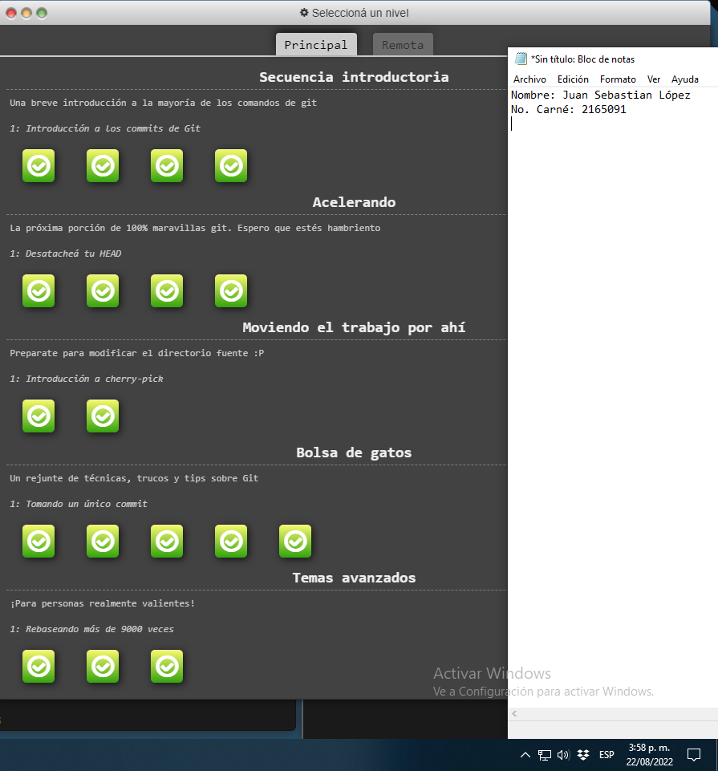
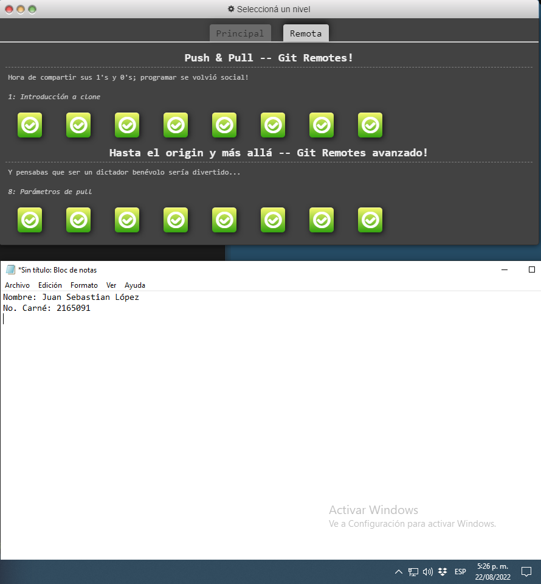

# Sobre Juan

### Datos básicos
* Nombre completo: Juan Sebastián López
* Edad: 20
* Carrera: Ingeniería de sistemas
* Universidad: Escuela Colombiana de Ingeniería Julio Garavito. 

### Hobbies
1. Tocar guitarra.
2. Ver cine.
3. Escribir y aprender código (*véase ejemplo 1*):
    ```
    while (true):
	    learn()
	```      
     **Ejemplo 1**

### Tatuajes
Mi tatuador, [Diego Lugo](https://www.instagram.com/alex_diaz350/?hl=es), es excelente. Tiene mucho talento, una mano muy cuidadosa, lo que hace que la curación de los tatuajes sea muy sencilla, y cobra muy barato. \
En este momento 5 de mis tatuajes los hizo él, y ya tengo 4 más planeados. 


# Parte III. - GIT BRANCHING

### Git branching - main:


### Git branching - remote:
